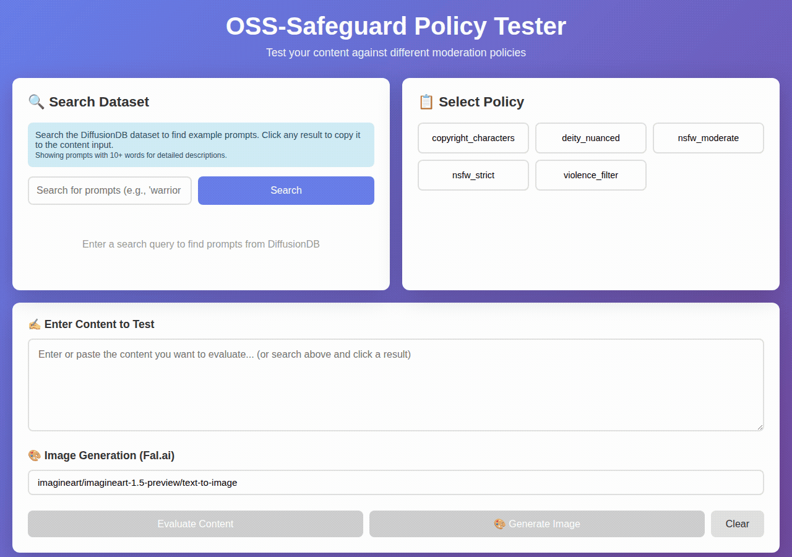

# OSS-Safeguard Policy Tester

A web app for evaluating content against moderation policies. Write a policy as a plain text file, paste in any prompt, and the safeguard model (`gpt-oss-safeguard-20b`) tells you whether it passes or fails — with a reason. Ships with a set of example policies to get you started.

## Demo



The animation shows the full evaluation workflow:
1. **Select a policy** — `copyright_characters` is chosen, which blocks named copyrighted characters and celebrities
2. **Enter a prompt** — a Spider-Man image generation request is typed into the content box
3. **Evaluate** — the safeguard model (`gpt-oss-safeguard-20b` via Groq) is called and returns **UNSAFE**, correctly identifying the Marvel character reference as a copyright violation

## How It Works

1. **Write or select a policy** — policies are plain text files that describe what to allow and block
2. **Enter a prompt** — type one directly, or search the DiffusionDB dataset (see below) to find real-world examples
3. **Evaluate** — the safeguard model returns `SAFE` or `UNSAFE` with an explanation
4. **Generate an image** (optional) — send the prompt to Fal.ai to see what it would actually produce

## Policies

Policies are `.txt` files in the `policies/` directory — add one and it appears in the UI automatically. Three example policies are included:

| Policy | Description |
|--------|-------------|
| `copyright_characters.txt` | Blocks named copyrighted characters and celebrities |
| `deity_nuanced.txt` | Allows artistic religious depictions, blocks photorealistic ones |
| `violence_filter.txt` | Blocks graphic violence, allows historical/fantasy context |

### Writing a Custom Policy

Create a `.txt` file in `policies/` using this structure:

```
You are a content moderation assistant. [Describe your use case]

Block:
- [What to disallow]

Allow:
- [What to permit]

Respond with:
- "SAFE" if the prompt is acceptable
- "UNSAFE" if it violates the policy

Provide a brief explanation.
```

The model will follow your instructions and explain every decision — making it easy to iterate on the wording until the policy behaves exactly as intended.

## Testing with Real-World Prompts (DiffusionDB)

The search panel lets you pull prompts directly from [DiffusionDB](https://huggingface.co/datasets/poloclub/diffusiondb) — a public dataset of 2 million Stable Diffusion prompts collected in the wild. This is useful for:

- **Learning to write policies** — see how real prompts phrase things and tune your policy to handle edge cases
- **Stress-testing a policy** — search for prompts that should be blocked and verify the model catches them; search for ones that should pass and confirm no false positives
- **Exploring what users actually ask for** — the dataset reflects real usage patterns, including borderline and ambiguous prompts

### Setting Up Search

Search requires a one-time local database build.

**Step 1 — Download the metadata:**

```bash
python fetch_diffusiondb.py
```

Downloads `metadata.parquet` (~185MB from HuggingFace), a one-time operation.

**Step 2 — Build the database:**

```bash
# Subset for quick testing (~50k prompts, a few minutes)
python search_and_evaluate.py --init --num-samples 50000

# Full 2M dataset (computes embeddings locally — takes a while)
python search_and_evaluate.py --init
```

This creates `prompts.db` with each prompt's text and a vector embedding. Search uses hybrid keyword + semantic matching, so queries like *"knight in dark forest"* return thematically related prompts even without exact word overlap.

Once the database is built, click any search result to copy the prompt directly into the evaluation box.

## Prerequisites

- Python 3.9+
- [Groq API key](https://console.groq.com) (free tier available) — for policy evaluation
- [Fal.ai API key](https://fal.ai/dashboard/keys) (optional) — for image generation

## Setup

```bash
git clone https://github.com/harshsinghal/safeguard-eval.git
cd safeguard-eval
python -m venv venv
source venv/bin/activate  # Windows: venv\Scripts\activate
pip install -r requirements.txt
cp .env.example .env      # add your GROQ_API_KEY and FAL_KEY
python app.py             # opens at http://localhost:5001
```

## Project Structure

```
safeguard-eval/
├── app.py                   # Flask web server
├── templates/
│   └── index.html           # Web UI
├── policies/                # Policy definition files (.txt)
├── fetch_diffusiondb.py     # Download DiffusionDB metadata.parquet
├── search_and_evaluate.py   # Build local SQLite database from parquet
├── .env.example             # Environment variable template
└── requirements.txt
```

## Using with Claude Code

This repo includes `CLAUDE.md`. Open the project in Claude Code and it will understand the architecture and can help you write new policies, extend the UI, or modify search behaviour.

```bash
claude
```

## License

MIT
